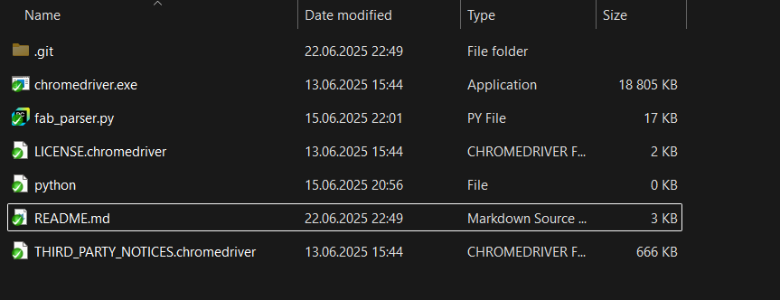

🧵 FAB Marketplace Parser
A Python script for automatically collecting information about 3D models listed on FAB Marketplace.
This tool was created by a 3D content creator to automate the repetitive process of preparing for sales events on the platform.

⚠️ For personal use only. Commercial use is strictly prohibited.

🔍 What It Does
Loads your public seller page (no login required)

Scrapes key data from each model:

- Title

- Direct link

- Price

- Rating

Saves the results to an .xlsx Excel file

Supports appending data to existing files via --append

📁 Project Structure

🚀 How to Use
1. Install dependencies
nginx
Copy
Edit
pip install -r requirements.txt
2. Make sure your ChromeDriver version matches your Chrome browser
If not sure how — read next section.

3. Run the script
nginx
Copy
Edit
python fab_parser.py https://www.fab.com/sellers/YOUR-PAGE -o existing_data.xlsx --append
Arguments:

URL ¨YOUR-PAGE¨ — your FAB seller profile

-o or --output — Excel file to save to

--append — adds data to existing file instead of overwriting

🛠 How to Install ChromeDriver
Open Chrome and go to chrome://settings/help
Copy your Chrome version (e.g. 114.0.5735.90)

Go to ChromeDriver downloads
Find the version that matches your Chrome’s major version (e.g. 114)

Download and extract chromedriver.exe
Place it in the same folder as fab_parser.py

Note: If Chrome updates, you might need to update chromedriver.exe as well.

⚠️ Limitations & Plans
Currently works reliably for up to ~24 assets (then FAB may detect bot)

Roadmap:

Batching requests to bypass anti-bot

Add preview image extraction

Improve error handling

📷 Example
Check output.xlsx for an example of the exported spreadsheet.

📄 License & Usage
For non-commercial use only

Do not use this to scrape other sellers' pages

Intended for original creators managing their own models

👤 Author
Made by a 3D content creator working with FAB NaughtyMonk.
Open to contributions — issues and pull requests welcome.
